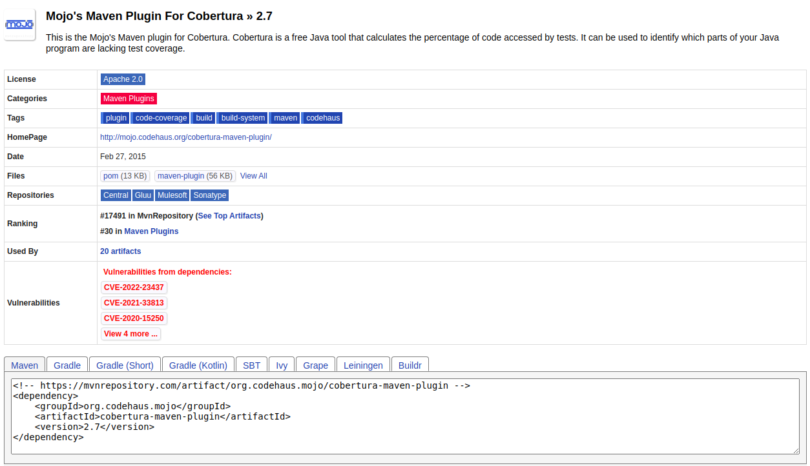
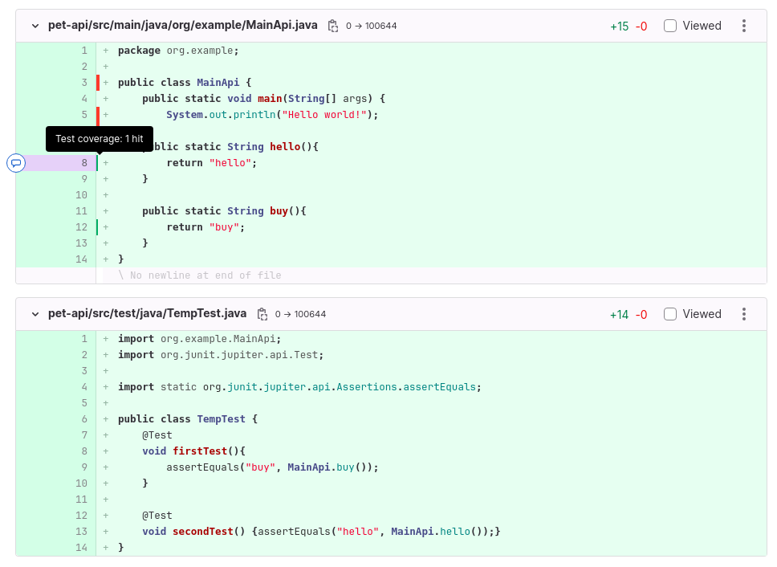

# GitLab ленится
## Проблема
В компании, которой я работаю, нашим основным средством для командной работы с репозиторием является `Gitlab`. И вроде бы всем он хорош: и бесплатной версии хватает сполна, и CI/CD - пайплайн имеется, и хранить артефакты тоже можно (Долой `Nexus`). Но и у `GitLab` есть свои грешки. 
Так, они до сих пор не смогли сделать визуализацию покрытия тестов. Да, она у них есть, но для этого нужно сгенерировать отчет о покрытии в формате `Cobertura`, а не популярной на данной момент `Jacoco`. Главная загвоздка в том, что [Cobertura plugin](https://mvnrepository.com/artifact/org.codehaus.mojo/cobertura-maven-plugin/2.7) последний раз обновлялся аж в 2015 году. 

То есть этот плагин уже не поддерживается `Java 8`. Ссылки на официальные источники прикреплены, чтобы вы могли понять насколько там все запущено))   

И что же нам предлагает сделать `GitLab`? Он сделал все «по-человечески»? Нет))) он предложил использовать скрипт на `Python` для перевода отчета в формате `Jacoco` в отчет в формате `Cobertura`. 

Выглядит это так:
```yml
test-jdk11:
  stage: test
  image: maven:3.6.3-jdk-11
  script:
    - mvn $MAVEN_CLI_OPTS clean org.jacoco:jacoco-maven-plugin:prepare-agent test jacoco:report
  artifacts:
    paths:
      - target/site/jacoco/jacoco.xml

coverage-jdk11:
  # Must be in a stage later than test-jdk11's stage.
  # The `visualize` stage does not exist by default.
  # Please define it first, or choose an existing stage like `deploy`.
  stage: visualize
  image: registry.gitlab.com/haynes/jacoco2cobertura:1.0.7
  script:
    # convert report from jacoco to cobertura, using relative project path
    - python /opt/cover2cover.py target/site/jacoco/jacoco.xml $CI_PROJECT_DIR/src/main/java/ > target/site/cobertura.xml
  needs: ["test-jdk11"]
  artifacts:
    reports:
      coverage_report:
        coverage_format: cobertura
        path: target/site/cobertura.xml
```
Подробнее об этом решении по [ссылке](https://docs.gitlab.com/ee/ci/testing/test_coverage_visualization.html).

Громоздко, правда? Даже приходится подключать дополнительный образ, чтобы скрипт заработал. 
Наша компания не одна заметила эту проблему. Так аж в 2020 году Markus Schuch создал [запрос](https://gitlab.com/gitlab-org/gitlab/-/issues/227345) разработчикам GitLab о добавлении поддержки отчетов о покрытии в формате `Jacoco`. Но решение данной проблемы так и не сдвинулось с мертвой точки. По этому руководством мне было поручено написать плагин, который будет переводить отчет `jacoco.xml` в  `cobertura.xml`. Убили двух зайцев: приятный функционал компании и занятый делом джун.
## Решение
Было решено написать плагин, который упростит создание отчета в формате `Cobertura`. Принцип работы плагина: перевести отчет формата `Jacoco` в `Cobertura`. 
## Проблемы написания плагина
### Подбор библиотек
Сначала для парсинга файла формата `XML` необходимо было подобрать библиотеку. Так как есть их разновидности со своими плюсами и минусами выбор оказался непростым.

Например, `DOM` парсер – это древовидный синтаксический анализатор. Таким парсером очень удобно искать элементы в файле, но у него есть недостаток – скорость. 

`SAX` парсер работает иначе, он не создает никакой файловой структуры, а последовательно читает/записывает `XML` файл. Поэтому `SAX` парсер работает гораздо быстрее чем `DOM`, но он не умеет так же хорошо искать элементы файла.
Поэтому мной была выбрана библиотека `JDOM2` для чтения `jacoco.xml` и `SAX` для записи в `cobertura.xml`.
### Написание алгоритма Jacoco в Cobetura
Основная идея алгоритма была позаимствована из питоновского скрипта [cover2cover.py](https://github.com/rix0rrr/cover2cover). Однако немного изменить логику алгоритма пришлось. Например, различная работа `XML` библиотек в `Python` и `Java`, различный результат при математических вычислениях чисел с плавающей запятой. 
После того как я понял, что алгоритм написанный на `Java` выдает такие же отчеты, что и `cover2cover.py` необходимо было реализовать удобство применения в сторонних java приложениях. Очевидно, что для этого необходимо написать плагин. О том как написать плагин есть хорошая [статья](https://www.baeldung.com/maven-plugin). 

Всего в мой плагине можно передать 3 переменный:
- **source** - путь к файлу формата `Jacoco` (дефолтное значение: `target/site/jacoco/jacoco.xml`).
- **result** - путь, куда файл cobertura.xml будет размещен после работы плагина (дефолтное значение: `target/site/cobertura/cobertura.xml`).
- **pathesToProject** - список путей к классам относительно корня проекта (дефолтное значение: `/src/main/java/`).

Очень важно чтобы по пути указанному в `source` лежал `jacoco.xml`, а то нечего будет переводить. Также в `pathesToProject` можно передавать как один путь к пакетам, так и несколько путей, если проект мультимодульный. 

Например, для проекта со структурой:
```text
pet-parent/
    +- pet/
        +- src/
            +- main/
                +- java/
                    +- pom.xml
                    ...
    +- pet-api/
        +- src/
            +- main/
                +- java/
                    +- pom.xml
                    ...
    +- pet-test/
        +- pom.xml
    +- pom.xml
```

Необходимо передать пути `/pet-api/src/main/java/` и `/pet/src/main/java/`. Теперь покрытия тестами обоих модулей будут видны!
## Как пользоваться
### В pom.xml
Плагин очень просто добавить в `pom.xml` и он будет генерировать отчет `cobertura.xml` туда, куда Вы скажете. В общем, работает он так же как и Jacoco плагин, главное правильно указать параметры и поставить его в `pom.xml` после Jacoco плагина.

Вот фрагмент `pom.xml`, в котором наглядно показано, как настраивать плагин:
```xml
<project>
    ...
    <build>
        <!-- To define the plugin version in your parent POM -->
        <pluginManagement>
            <plugins>
                <plugin>
                    <groupId>ru.siblion.lab</groupId>
                    <artifactId>jacocoToCobertura-maven-plugin</artifactId>
                    <version>0.0.1</version>
                </plugin>
                ...
            </plugins>
        </pluginManagement>
        <!-- To use the plugin goals in your POM or parent POM -->
        <plugins>
            <plugin>
                <groupId>ru.siblion.lab</groupId>
                <artifactId>jacocoToCobertura-maven-plugin</artifactId>
                <executions>
                    <execution>
                        <goals>
                            <goal>jacoco-to-cobertura-convert</goal>
                        </goals>
                    </execution>
                </executions>
                <configuration>
                    <source>path to jacoco.xml</source>
                    <result>path to cobertura.xml</result>
                    <pathesToProject>path to classes of module</pathesToProject>
                </configuration>
            </plugin>
            ...
        </plugins>
    </build>
    ...
</project>
```
А для мультимодульного проекта (возьмем пример из прошлой главы) параметр `pathesToProject` будет выглядеть так:
```xml
<pathesToProject>/pet/src/main/java/,/pet-api/src/main/java/</pathesToProject>
```
То есть просто перечисляем через запятую.
Теперь каждый раз после запуска тестов, будет появляться отчет в формате `Cobertura`)))

В `.gitlab-ci.yml` необходимо будет добавить, чтобы `GitLab` увидел отчет

```yml
artifacts:
    reports:
      coverage_report:
        coverage_format: cobertura
        path: target/cobertura/cobertura.xml
```
### В CI/CD пайплайне
Иногда не хочется лишний раз изменять `pom.xml`, чтобы ничего не поломалось. Поэтому работу jacocoToCobertura плагина можно настроить в файле `.gitlab-ci.yml`:
```yml 
coverage:
  needs: ["mvn-test"]
  stage: quality_gate
  script:
    - "./mvnw -U $MAVEN_CLI_OPTS dependency:get -Dartifact=ru.siblion.lab:jacocoToCobertura-maven-plugin:0.0.1"
    - "./mvnw $MAVEN_CLI_OPTS ru.siblion.lab:jacocoToCobertura-maven-plugin:0.0.1:jacoco-to-cobertura-convert
        -Dsource=\"/target/jacoco/jacoco.xml\"
        -Dresult=\"/target/cobertura/cobertura.xml\"
        -DpathesToProject=\"/src/main/java/\""
  allow_failure: true
  coverage: "/Total.*?([0-9]{1,3})%/"
  artifacts:
    reports:
      coverage_report:
        coverage_format: cobertura
        path: target/cobertura/cobertura.xml
  only:
    - merge_requests
    - main
```
## Результат
Теперь после успешного выполнения пайплайна в изменениях в Merge request появится красивая подсветка, которая показывает какой код покрыт тестами, а какой нет



Кроме того, после выполнения пайплайна итоговое покрытие проекта будет отображаться в `Jobs` пайплайна


## Технические ограничения
Плагин написан на `Java 17`. Требуется наличие `Jacoco plugin`, стоящий в `pom.xml` выше, чем `jacocoToCobertura-plugin`. Визуализация покрытия сохраняется неделю после чего, пропадает. 

От `GitLab`: не более 100 источников `source` в отчете, то есть не более 100 модулей в проекте. Размер одного XML-файла `Cobertura` не может превышать 10 МБ. Подробнее про ограничения от `GitLab` [тут](https://docs.gitlab.com/ee/ci/testing/test_coverage_visualization.html#limits).

## Авторы
- Дмитриев Егор
- Митрофанов Сергей
- [Siblion](https://www.siblion.ru/)